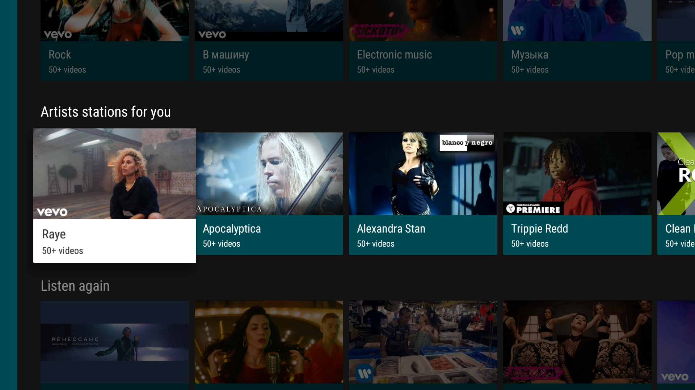

# SmartTubeNext 

<p align="center">
    
</p>

SmartTubeNext is an _unofficial_ YouTube client for Android TV. The project currently consists of:

- Android TV application
- Unit tests for media service
- User interface tests (planned)


Current release of the application allows you to:

- Browse range of public video categories: News, Games, Music
- Browse range of private video categories: Subscriptions, History, Playlists
- Apply actions for currently playing video: Like, Dislike, Subscribe
- Play videos
- Search for videos
- View subscribed channel content
- Change various settings for the video player
- Android TV channels and search support

# Screens

## [Browse Fragment](/smarttubetv/src/main/java/com/liskovsoft/smartyoutubetv2/tv/ui/browse/BrowseFragment.java)

The browse fragment is what is used to display the browseable categories and options card. The
[Icon Header Item Presenter](/app/src/main/java/com/hitherejoe/vineyard/ui/presenter/IconHeaderItemPresenter.java) is used
to setup and display the categories in the headers dock, the [Post Adapter](/app/src/main/java/com/hitherejoe/vineyard/ui/adapter/PostAdapter.java) and  [Card Presenter](/app/src/main/java/com/hitherejoe/vineyard/ui/presenter/CardPresenter.java)
is used to display the Post cards and the [Icon Item Presenter](/app/src/main/java/com/hitherejoe/vineyard/ui/presenter/IconItemPresenter.java) sets and displays
the option and error message cards.

<p align="center">
    
</p>
<p align="center">
    
</p>


##[Playback Activity](/app/src/main/java/com/hitherejoe/vineyard/ui/activity/PlaybackActivity.java)

The Playback Activity is used to play the video from a Vine post. Which used the [PlaybackOverlayFragment](/app/src/main/java/com/hitherejoe/vineyard/ui/fragment/PlaybackOverlayFragment.java) to display the playback controls over the top of the PlaybackActivity.

<p align="center">
    
</p>

<p align="center">
    
</p>


##[Search Fragment](/app/src/main/java/com/hitherejoe/vineyard/ui/fragment/SearchFragment.java)

The Search Fragment allows users to search for Vine Posts by either tags or usernames. The
[Tag Presenter](/app/src/main/java/com/hitherejoe/vineyard/ui/presenter/TagPresenter.java) is used to
display the tag/username query results, the posts are then displayed beneath whenever a tag/username
result becomes focused.

<p align="center">
    
</p>

<p align="center">
    
</p>

##[Post Grid Fragment](/app/src/main/java/com/hitherejoe/vineyard/ui/fragment/PostGridFragment.java)

The Post Grid Fragment is used to show a grid of videos from either a Hashtag or User feed. This screen
is launched when a hashtag/username result is clicked in the [Search Fragment](/app/src/main/java/com/hitherejoe/vineyard/ui/fragment/SearchFragment.java).

<p align="center">
    
</p>

##[AutoLoop Step Fragment](/app/src/main/java/com/hitherejoe/vineyard/ui/fragment/AutoLoopStepFragment.java)

The AutoLoop Step Fragment is used to toggle the AutoLoop setting for post videos. When enabled,
videos will automatically loop until the video is either stopped or skipped. If this is not enabled
then videos will automatically play until the final one in the playlist is reached.

<p align="center">
    
</p>

#Custom Components

Many of the screens used some of these custom components created especially for the needs of this app:

##[Video Card View](/app/src/main/java/com/hitherejoe/vineyard/ui/widget/VideoCardView.java)

<p align="center">
    
</p>

This view extends the BaseCardView class so that we can make our own custom CardView. The functionality
of this view is display a video preview of the vine post card that is currently in focus. It's made up
of the following components:

- [Looping Video View](/app/src/main/java/com/hitherejoe/vineyard/ui/widget/LoopingVideoView.java) - This is a custom VideoView that automatically loops a video without sound.
- [Preview Card View](/app/src/main/java/com/hitherejoe/vineyard/ui/widget/PreviewCardView.java) - This is the layout class used by the video card view.

##[Pagination Adapter](/app/src/main/java/com/hitherejoe/vineyard/ui/adapter/PaginationAdapter.java)

Here I created a custom adapter by extending the standard ArrayObjectAdapter to allow the application
to handle pagination requests. When the final item in a row of Posts becomes focused, the paginated
request is triggered and the [Loading Card View](/app/src/main/java/com/hitherejoe/vineyard/ui/widget/LoadingCardView.java) is displayed
until the results are returned.

##[Loading Card View](/app/src/main/java/com/hitherejoe/vineyard/ui/widget/LoadingCardView.java)

The Loading Card View again extends the BaseCardView class and is a simple cardview that displays
a loading indicator to the user. This is used when Pagination is in use (using the PaginationAdapter)
to notify the user that Posts are being loaded.

<p align="center">
    
</p>

##[Tag Card View](/app/src/main/java/com/hitherejoe/vineyard/ui/widget/TagCardView.java)

The Tag Card View again extends the BaseCardView class and is a simple cardview that displays either
a hashtag or username. This is used to display the search results in the SearchFragment.

<p align="center">
    
</p>

##[Icon Card View](/app/src/main/java/com/hitherejoe/vineyard/ui/widget/IconCardView.java)

The Icon Card View again extends the BaseCardView class and is an interactable cardview that can be used to
display an icon with both a title and description. Currently I use this for several different situations:

- Displaying options

<p align="center">
    
</p>

- Displaying a 'Try Again' card when there is an error fetching results

<p align="center">
    
</p>

- Displaying a 'Check Again' card when an empty result list is returned

<p align="center">
    
</p>

#Building

To build, install and run a debug version, run this from the root of the project:

````./gradlew assembleDebug```

#Unit Tests

To run the unit tests for the application:

````./gradlew testDebugUnitTest```

#User Interface Tests

To run the user interface tests for the application:

````./gradlew connectedDebugAndroidTest```
