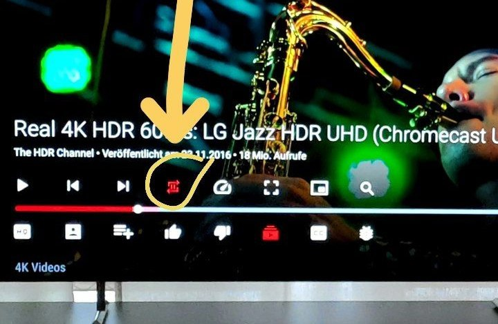

# SmartTube (old name SmartTubeNext)
  


**SmartTube** is an advanced player for **Android TVs** and **TV boxes**, free & open source. You can play content from different public sources.

:white_check_mark: **Features**: no ads ‧ SponsorBlock ‧ adjustable playback speed ‧ 8k support ‧ 60fps ‧ HDR ‧ read live chat ‧ customizable buttons ‧ no Google Services ‧ helpful international community

:x: **Disadvantages**: no support for phones and tablets, no comments
stability, voice search and casting support **might** be worse than in the official apps, depending on your device; give it a try!

**Do you have any question?** Ctrl+F or ⌘F this readme first!

[**Installation**](#installation) | [**Official Site**](https://smarttubeapp.github.io) | [**Donation**](#donation) | [**FAQ**](#faq) | [Support / Chat](#support) | [Build](#build) | [Translate the app](https://jtbrinkmann.de/tools/android-strings.xml-translator.html) | [Changelog](https://t.me/s/SmartTubeNewsEN) | [Liability](#liability)


## Device support


## Installation

> [video of the installation](images/new/zPV0imF.mp4) (note: download url changed to `kutt.it/stn_beta` or `kutt.it/stn_stable`)

**Do not** download SmartTube from any **app store**, APK websites or blogs; these were uploaded by other people and may contain malware or ads. SmartTube is not officially published on any app store. Sadly, the Google PlayStore does not allow ad-free Youtube apps using unofficial APIs.

There is a **beta release** (recommended) and a **stable release**. Beta gets new features and bugfixes faster than the stable release.

You can use either of the following methods to install the app:

- (**easiest**) install [Downloader by AFTVnews](https://www.aftvnews.com/downloader/) on your Android TV, open it and enter `kutt.it/stn_beta` or `kutt.it/stn_stable`, then read, understand and confirm the security prompts. (<small>You can also enter [**79015**](https://aftv.news/79015) (for beta) or [**28544**](https://aftv.news/28544) (for stable), but this requires an extra step to install the AFTVnews Downloader browser addon if you haven't already.</small>)
- install a file transfer app on your Android TV, download the APK on your phone or computer and transfer it to your TV (e.g. [_Send Files to TV_](https://sendfilestotv.app/) from the Google Play Store / Amazon AppStore)
- download the APK onto a USB stick, put the USB stick into your TV and use a file manager app from the Google Play Store / Amazon AppStore (e.g. [_FX File Explorer_](https://play.google.com/store/apps/details?id=nextapp.fx) or [_X-plore_](https://play.google.com/store/apps/details?id=com.lonelycatgames.Xplore)). Android's preinstalled file manager does not work! Do **not** get the ad-infested _FileCommander_.
- if you are an advanced user, you can install it using ADB. [guide](https://fossbytes.com/side-load-apps-android-tv/#h-how-to-sideload-apps-on-your-android-tv-using-adb) | [alternative guide](https://www.aftvnews.com/sideload/)

**Troubleshooting:** See device specific notes below. If installation fails, either your **disk space is full** or the APK file didn't download correctly; clear up space and try downloading again. If the app installed, but crashes when opening, make sure to install it to internal memory, not to an SD card / external storage.

**The app has a built-in updater** with changelog. You can also find all releases and the **changelog** on the [Telegram channel @SmartTubeNewsEN](https://t.me/s/SmartTubeNewsEN) (readable without account) or on [Github](https://github.com/yuliskov/SmartTube/releases/).

> latest [**beta download**](https://github.com/yuliskov/SmartTube/releases/download/latest/smarttube_beta.apk)
>
> latest [stable download](https://github.com/yuliskov/SmartTube/releases/download/latest/smarttube_stable.apk)


### Installation (Chromecast with Google TV)

On **Chromecast with Google TV**, installation of apps is blocked by default, so an extra step is required:

> **4.1. Enable Developer Options**
>
> On your Chromecast, open the side menu and go to _Settings > System > About_. Scroll down to the _Android TV OS build_ section and click that repeatedly. A toast message will appear, explaining that you are a few steps away from being a developer. Continue clicking until you trigger it.
>
>
> **4.2. Turn on the "unknown sources" setting**
>
> Go back to the main _Settings_ page and select _Apps > Security & Restrictions > Unknown sources_. Turn on the toggle for \[_Downloader by AFTVnews_ or\] whichever file browser you decided to use [...].
>
> [[source & picture guide](https://www.androidpolice.com/2021/02/07/how-to-sideload-any-apk-on-the-chromecast-with-android-tv/#install-the-apk)]

After this, you can follow the [general installation guide](#installation) above.


### Installation (Xiaomi devices with Chinese firmware)

Xiaomi's **Chinese firmware** might block the installation **of the beta version**. The international firmware is not affected. Solutions:
1. use SmartTube's **stable version** instead (**recommended**)
2. use the international firmware for your device
3. (if your device is from 2020 or before) You can do a factory reset and then install SmartTube beta before doing any system updates. You can then safely update your system, SmartTube should continue working.


### Updating

The app has a built-in updater. You only need to follow the installation procedure **once**. A few seconds after launching SmartTube, it will notify you if there is any update and also show a changelog. You can disable automatic update checks or manually update in the settings under "about".

If the installation fails, either your **disk space is full** or the update didn't download correctly; clear up space and try updating again (_Settings > About > Check for updates_).


## Compatibility

SmartTube requires Android 4.3 or above. It does not work on non-Android devices (incl. LG or Samsung TVs). On unsupported TVs, you can use a TV stick or TV box. Though this app technically runs on smartphones and tablets, it is not optimized for such and offers no official support!

It has been successfully tested on TVs, TV boxes and TV sticks that are based on Android, including:

- Android TVs & Google TVs (e.g. Philips, Sony)
- Chromecast with Google TV & TVs with _Chromecast built-in_
- Amazon FireTV stick (all generations)
- NVIDIA Shield
- TV boxes running Android (many cheap chinese no-name boxes)
- Xiaomi Mi Box


## Features

### Adblocking

SmartTube does not show any ad banners, preroll ads or ad intermissions. It not just tries to prevent them, it is literally programmed to be completely **unable** to display any ads, so YouTube cannot slip anything in. This also means you cannot allow ads or whitelist channels. Some YouTube channels include sponsored messages in their videos, these can also be skipped, see [SponsorBlock](#SponsorBlock) below.


### SponsorBlock

SmartTube includes a SponsorBlock integration. From the [SponsorBlock website](https://sponsor.ajay.app/):

> SponsorBlock is an open-source crowdsourced browser extension and open API for **skipping sponsor segments** in YouTube videos. [...] the extension automatically skips sponsors **it knows about** using a privacy preserving query system. It also supports skipping **other categories**, such as intros, outros and reminders to subscribe [and non-music parts in music videos].

You can select which categories you want to skip in the settings. Unlike the browser addon, in SmartTube you cannot submit new segments (TVs and TV remotes aren't great devices for such precise operations). Note that SponsorBlock is a free and voluntary project based on user submissions, so don't expect it to 100% work every time. Sometimes, sponsor segments are not yet submitted to the database, sometimes the SponsorBlock servers are offline/overloaded.


### Casting

To cast videos from your phone (or other devices), you must link that device to your TV. Unlike the original YouTube app, SmartTube does not automatically show up when you are in the same wifi network. How to link your smartphone and TV:

1. open SmartTube and go to settings
2. go to "Remote control" (2nd option)
3. open your YouTube app on your phone, go to settings > General > watch on TV
4. click on _connect using TV-code_ and enter the code from your TV

[**Screenshot guide**](https://t.me/SmartTubeEN/8514)

Due to technical limitations, you need to open the app on the TV before casting; SmartTube cannot automatically wake up the TV.


### Picture-in-Picture (PiP)

SmartTube supports playing videos in PiP mode. This needs to be enabled under _Settings > General > Background playback > Picture in picture_. The video will go into PiP mode when you press home while playing a video, and also when you press _back_ if enabled in _Settings > General > Background playback (activation)_.


### Adjust Speed

You can adjust the playback speed pressing the speed-indicator icon (gauge) in the top row of the player. This is remembered across videos. Some speeds may case frame drops, this is a known issue.


### Voice Search

To enable global voice search, an additional app must be installed alongside SmartTube. This _bridge app_ can intercept the System's attempts to open the original YouTube app and open SmartTube instead. For this to work, you must uninstall the original YouTube app. We know this sucks, but you can always reinstall it if you change your mind. The _bridge app_ will not show up in your launcher and you cannot launch it directly; it is only used internally by the system's voice search. On some devices, you need to explicitly say "Youtube" when searching (e.g. say "youtube cute cats" instead of just "cute cats").

**On Amazon Fire TV**: 

1. uninstall the original YouTube app (no root required)
2. download and install the Amazon Bridge SmartTube app: https://kutt.it/stn_bridge_amazon (e.g. via _Downloader by AFTVnews_)


**On Google Chromecast with Google TV**: 

1. uninstall the original YouTube app (no root required)
3. download and install the ATV Bridge SmartTube app: https://kutt.it/stn_bridge_atv (e.g. via _Downloader by AFTVnews_)


**On all other Android devices**, sadly root is required to enable this:

1. root your device (search for a guide for your specific device)
2. uninstall the official YouTube app using root (`adb shell pm uninstall com.google.android.youtube.tv`)
3. download and install the ATV Bridge SmartTube app: https://kutt.it/stn_bridge_atv (e.g. via _Downloader by AFTVnews_)


## Donation

If you want to support my developments you are welcome to buy me a cup of coffee :)

> [**Patreon (Visa, Mastercard, PayPal)**](https://www.patreon.com/smarttube)  
> **PayPal**: firsth<!-- abc@def -->ash@gmai<!-- @abc.com -->l.com  
<!-- > [**Buy me a coffee**](https://www.buymeacoffee.com/stube) -->  
> **BTC**: 1JAT5VVWarVBkpVbNDn8UA8HXNdrukuBSx  
> **LTC**: ltc1qgc24eq9jl9cq78qnd5jpqhemkajg9vudwyd8pw  
> **ETH**: 0xe455E21a085ae195a097cd4F456051A9916A5064  
> **ETC**: 0x209eCd33Fa61fA92167595eB3Aea92EE1905c815  
> **XMR**: 48QsMjqfkeW54vkgKyRnjodtYxdmLk6HXfTWPSZoaFPEDpoHDwFUciGCe1QC9VAeGrgGw4PKNAksX9RW7myFqYJQDN5cHGT    
> **USDT (ERC20)**: 0xe455e21a085ae195a097cd4f456051a9916a5064  


## Support

**Please check the [FAQ](#faq) first!** Also at least have a short look at the recent chat history.

You can report in our Telegram group or via [issue tracker on Github](https://github.com/yuliskov/SmartTube/issues) (account required).

> **Telegram group (international)**: [@SmartTubeEN](http://t.me/SmartTubeEN)  
> **Telegram group (RU/UA)**: [@SmartTubeUA](http://t.me/SmartTubeUA)  
> **Email**: first.hash at gmail dot com

The international group is in **English only**. But don't worry if your English is not perfect, we have a friendly international community.


## Team

SmartTube is developed single-handedly; there is no larger team or company behind this. This is an open source, hobby project. Several others have helped with translations, some of which can be seen on [Github](https://github.com/yuliskov/SmartTube/graphs/contributors), some have sent their translations directly to Yurii. There are also helpful people in the support chat.


## Build
    
**NOTE: OpenJDK 14 or older (!) is required. Newer JDK could cause app crash!**  
To build and install debug version, run these commands:

```
git clone https://github.com/yuliskov/SmartTube.git
cd SmartTube
git submodule update --init
adb connect <device_ip_address>
gradlew clean installStorigDebug
```


## Video codecs

Video codecs are the algorithms used for video compression.


### Which codec to choose / overview

|          | recommendation                               | hardware support             | compression, bitrate\*              | quality |
|:--------:|:---------------------------------------------|:---------------------------- |:----------------------:|:-------:|
| **AV01** aka. AV1 | best choice, **if your device supports** | first devices started coming in **2020**   | **best** <small>(e.g. 1.6 Mbps)</small>   | same   |
| **VP9**  | **best choice on most devices**         | most devices **since 2015** | **better** <small>(e.g. 2.1 Mbps)</small> | same   |
| AVC  | only for old or slow hardware | **all** devices             | good <small>(e.g. 2.7 Mbps)</small>   | same   |


<small>\* Examples taken from the video-only track at 1080p @ 25fps for this video: [Dua Lipa - New Rules (Official Music Video)](https://youtube.com/watch?v=k2qgadSvNyU)</small>

At the same resolution, a **lower bitrate is better!** YouTube explicitly targets the **same quality** regardless of the codec. Older codecs have a higher bitrate only because they are less efficient. On Youtube, you **do not** get better quality by simply choosing a higher bitrate. Newer codecs have a better compression = lower bitrate = use less bandwidth = save the environment. This is a feature, not a bug. You should use the newest codec that works smoothly on your device, not the least efficient one. AVC usually has the highest bitrate. This is bad, not good.


### Which quality to choose?

Currently, there is no automatic mode based on your bandwidth. But you can configure a default video preset yourself under settings \> video player \> video presets. The first option ("none") will remember your last selection within the video player. Any other preset is used initially for each video; if the selected profile is not available, the next best available option is used. You can still override the profile on each video individually within the player.

To decide the optional resolution / video quality for you, you need to consider a few limiting factors:
- your bandwidth (choose only up to the bitrate that your bandwidth can handle; you can do a speedtest using [fast.com](https://fast.com) by Netflix)
- your TV's display resolution (the quality **might slightly** improve, if you select the next higher resolution, e.g. 1080p on a 720p display; but don't expect a big difference)
- your TV's capabilities (e.g. HDR, 60fps)

Generally 60fps is an improvement, but if you personally don't notice (or mind) the difference, you can save bandwidth (and the environment) by not choosing 60fps.


### HDR

HDR works only **if your hardware supports it**. It's a complicated mess.
- Your TV must support it
- If you use a TV box, that TV box **and** your TV cable **and** the TV must support HDR
- Yes, there truly are different HDMI cable versions with different HDR-support, it's complicated
- some devices (like the **NVIDIA Shield**) generally support HDR, but **not** the specific HDR format that is used on YouTube :cry:
 
If HDR videos look looked dim or washed out, then check [this article](https://www.wired.com/story/hdr-too-dark-how-to-fix-it/). **If HDR is not working**, it's probably not this app's fault. You might need to search on the web for "HDR" and your device name for any help.

## Liability

We take no responsibility for the use of our tool, or external instances
provided by third parties. We strongly recommend you abide by the valid
official regulations in your country. Furthermore, we refuse liability
for any inappropriate use of Invidious, such as illegal downloading.
This tool is provided to you in the spirit of free, open software.

You may view the LICENSE in which this software is provided to you [here](./LICENSE.md).

>   16. Limitation of Liability.
>
> IN NO EVENT UNLESS REQUIRED BY APPLICABLE LAW OR AGREED TO IN WRITING
WILL ANY COPYRIGHT HOLDER, OR ANY OTHER PARTY WHO MODIFIES AND/OR CONVEYS
THE PROGRAM AS PERMITTED ABOVE, BE LIABLE TO YOU FOR DAMAGES, INCLUDING ANY
GENERAL, SPECIAL, INCIDENTAL OR CONSEQUENTIAL DAMAGES ARISING OUT OF THE
USE OR INABILITY TO USE THE PROGRAM (INCLUDING BUT NOT LIMITED TO LOSS OF
DATA OR DATA BEING RENDERED INACCURATE OR LOSSES SUSTAINED BY YOU OR THIRD
PARTIES OR A FAILURE OF THE PROGRAM TO OPERATE WITH ANY OTHER PROGRAMS),
EVEN IF SUCH HOLDER OR OTHER PARTY HAS BEEN ADVISED OF THE POSSIBILITY OF
SUCH DAMAGES.

## FAQ

### Q: Videos buffer a LOT

A: Try to switch to encrypted DNS like NextDNS. You can set-up such DNS either automatically or manually. To automatic set-up you can use the [Intra apk at fdroid](https://f-droid.org/en/packages/app.intra/) and the ["AutoStart - No root"](https://play.google.com/store/apps/details?id=com.autostart) apk to make it autolaunch after every TV restart. For manual set-up [use this guide](https://www.reddit.com/r/MiBox/s/7esEVGtAAa).

### Q: There is no result for the search that I say (Android 11)

A: They're some reports that the latest update for "Google app for Android TV" could cause this bug. Deleting the update should fix the problem.


### Q: AV01 does not play / Why is VP9 slow on my device?

A: Because AV01 is very new, **most** TVs and TV boxes **not not** offer hardware support and **cannot** play AV01 **at all**.

If your device has hardware support for a codec, videos using that codec should play smoothly. High resolutions might also be slow in VP9 on cheap TV boxes that don't officially support 4k. Your device probably can play VP9 videos even without hardware support, however this requires a powerful CPU to run smoothly. Fixing AV01 without hardware support is technically possible, but currently not planned and probably not efficient enough.


### Q: Can you make SmartTube look like the original app?

A: Compared to SmartTube's UI, Stock Youtube and YT Kids are far ahead. However, we'd need someone who's skilled and willing to dedicate enough time and energy into making it. And into maintaining it longterm (incl. new features, bug fixes). All of this for free. If you are / got someone like that, please help.
Not to mention that SmartTube follows Google's official template & recommendations for Android TV apps. It's Google's fault that the template is somewhat ugly. 😂


### Q: Can the search page be improved?

A: It can be, but it takes someone to do it, similar to the above FAQ-entry. SmartTube is following Google's officially recommended design/template for TV apps and is using the official, preinstalled Android TV keyboard. Sadly, Google did a really bad job regarding the search page and keyboard. Maybe a future SmartTube update can add an embedded keyboard, similar to the original YouTube or other major Android TV apps. Maybe it can improve the looks to be as good or better than in the official YouTube app. But for now, it is the way it is due to lack of time and due to Google's official recommendations being bad.


### Q: Can I install this on a Samsung Tizen TV / LG webOS TV / Roku / iOS / toaster?

A: No, this only works on **Android** devices. If you look at an Android TV's product page, it usually says clearly that it's based on Android. The app **cannot** easily be ported over to other plattforms and we have no plans to even try. **Please do not ask**. Instead, you can connect a separate TV stick or TV box to your TV.


### Q: Can I install this on a smartphone? / Can you add portrait mode? / Scrolling doesn't work.

A: **Big No**. This app is **not** for smartphones, we offer **zero support** for that.

You **can cast** videos **from** your smartphone to a TV / TV box running SmartTube, though. Just use the official YouTube app or [ReVanced](https://github.com/ReVanced), see [the casting section](#casting) for more information.

**There will not be a phone version.** You can use [ReVanced](https://github.com/ReVanced), [Pure Tuber](https://play.google.com/store/apps/details?id=free.tube.premium.advanced.tuber), [NewPipe](https://newpipe.schabi.org), or [NewPipe x SponsorBlock](https://github.com/polymorphicshade/NewPipe#newpipe-x-sponsorblock) instead. Please go to their respective support chats for help.


### Q: Can I install this on a tablet / car screen / smartphone with docking station?

Yes... maybe.. Requirements:

- it is an Android device
- it has a large screen
- it has a TV remote, controller, or keyboard
  **Touch input and is not supported.** Mouse/touchpad scrolling neither. You cannot properly use SmartTube with only touch or mouse input.

Some users reported great success (incl. on a [car entertainment system](https://t.me/SmartTubeEN/6060)). **Please share your success stories with us.**


### Q: I get "unknown codec" / "can't download video" errors

A: please wait 5 seconds for the video to play. If that doesn't help, press the play button. Some users reported, that this issue only appears when they have a USB audio device attached or if their disk storage is full.


### Q: I get "the video profile is not supported"

A. Press the "HQ"-button in the bottom-left, select _video formats_ and select anything other than AV01. AV01 is **not supported** on most devices (apparently including yours), so select VP9 instead. See [the section on video codecs](#Video-codecs) for more information.


### Q: I get "video unavailable" when watching unlisted videos / my own videos

A: Right, that's currently a bug.


### Q: It doesn't show up on my casting list

A: Please read the [Casting](#casting) section.


### Q: The video is buffering a lot

A: The issue might not be specific to SmartTube, as other unofficial YouTube apps also report this issue. It seems uncommon nowadays, but was very present in the 2nd quarter of 2021. Some users or devices seem to be more affected then others. The official YouTube app & website are apparently only rarely affected. The root cause of the issue is currently unclear, but it appears to be a server-side thing on YouTube's end. Possibly, YouTube is discriminating 3rd party apps.

For now, try to see if it helps to:

- reduce the resolution (or chance it back)
- change the video format to AVC
- increase the buffer in the settings
- hit the back button and try playing the video again


### Q: The debug information says my display is 1080p, but I have a 4k/UHD display!

A: Do not worry, **the debug information is incorrect.** SmartTube works fine even above 1080p and you should be able to see that, when you play a video in 4k or UHD.
Also do not worry if it says "720p" and you have a 1080p display.


### Q: Why does it not autoselect highest quality?

A: **It does** (by default). If you set a _video profile_ under settings, that acts as a maximum for automatic selection. Check if you configured a video profile, you can unset it by choosing "none".

**Please do not confuse quality with bitrate**. See [the section on video codecs](#Video-codecs) for more information.


### Q: Can I set a (maximum) resolution by default?

A: SmartTube automatically select the highest available quality for your video, up to a maximum resolution that you can set in the settings under "video profile". If available, SmartTube will pick the selected video profile, or otherwise the next best one available will be used. You can still always change the video profile while watching videos.


### Q: Can it set the resolution to "auto", depending on my available bandwidth?

A: This is planned, but not available yet (sorry 🙇‍♀️). However, you can set a maximum resolution to something that should work for your bandwidth. See above for details.


### Q: Why does it skip video segments?

A: SmartTube has a feature called **SponsorBlock**. You can select categories should be skipped, if any. See the [SponsorBlock section](#sponsorblock) for more details.


### Q: How to start the next video automatically / stop after every video?

A: You can switch between different autoplay-modes using the loop-button 🔁

[](https://t.me/SmartTubeEN/24953)


### Q: How to remove recommended videos (e.g. news) that are unrelated to me?

A: Recommended videos are defined by YouTube and not by the app, we cannot change the algorithm. They are based on your country, which you can change in the settings. If you are logged in, they are based on your watch history, user profile data, and whatever else Google might use. If you are not logged in, you are like in "incognito mode", so your watch history does not influence your recommendations. Maybe a future version will add optional user profiling without logging in.


### Q: Does HDR work?

A: Yes, HDR works **if your hardware** supports it. The **NVIDIA Shield** does not. See [the section on HDR](#HDR) for more information.


### Q: Why do some updates say "don't update if satisfied with the current version" in the changelog?

A: These updates change a lot of code, trying to fix bugs that only affect a few users/devices. Only the affected users should update. For anyone else, there is nothing to gain from updating; however there is the chance of causing new bugs. Do not worry if you updated anyways.


### Q: When playing at other speeds, frames are skipped!

A: We currently cannot fix this, sorry.


### Q: What is AFR?

A: "Auto Frame Rate". It adjusts the refresh rate of your TV to match the content you're watching. It can slightly improve the smoothness, but the difference is very small; most people barely notice it. It does not work well on every hardware. If you don't know what it does and don't want to test it out yourself, you can safely keep it off.

**Recommendation:** You can turn it on to see if it works on your device; if it causes issues (or if you don't care to test), turn it **off**.


### Q: Should I choose high or low buffer?

A: The higher your buffer, the more of a video will be preloaded ahead of your current position. A low buffer might minimally reduce your bandwidth usage, if you often close videos before they end. A high buffer can smooth out network issues and prevent the video from pausing to buffer. A higher buffer increases RAM usage, however this shouldn't be an issue.

**Recommendation: high**.


### Q: Can I retain the buffer when seeking back?

A: No, when you seek back (e.g. jump back 5 seconds), SmartTube will have to rebuffer. This might be improved in a future update.


### Q: My device freezes when watching YouTube

A: That's a firmware or Android issue. If you are using a custom rom, maybe that rom is buggy. Because this issue is nearly impossible for the developer to debug, we cannot help you, sorry. You can try the usual workarounds: rebooting, clearing cache, reinstalling the app, or factory resetting the device.


### Q: Can I remove videos from the history?

A: not yet


### Q: Can I download videos?

A: not with SmartTube


### Q: Can updates be installed automatically?

A: no, this is technically not possible. Only the preinstalled app manager (usually Google PlayStore, Amazon AppStore, etc) has the required permission. All other apps, incl. SmartTube can only show open installation prompt. A workaround using root would be possible, but hasn't been implemented yet.


### Q: Can I whitelist ads on some channels?

A: no, this is not possible. SmartTube does not have any code to display ads. Adding this functionality would actually take time and effort, which is instead spent on adding useful features and fixing bugs.

