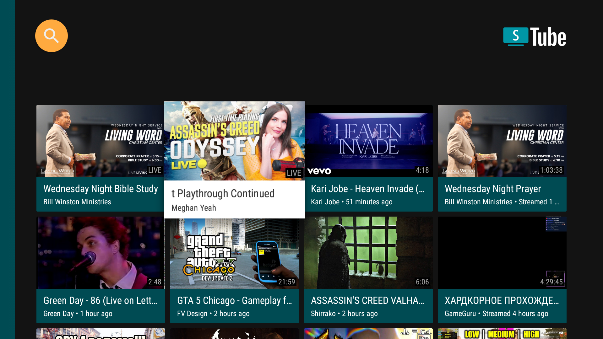
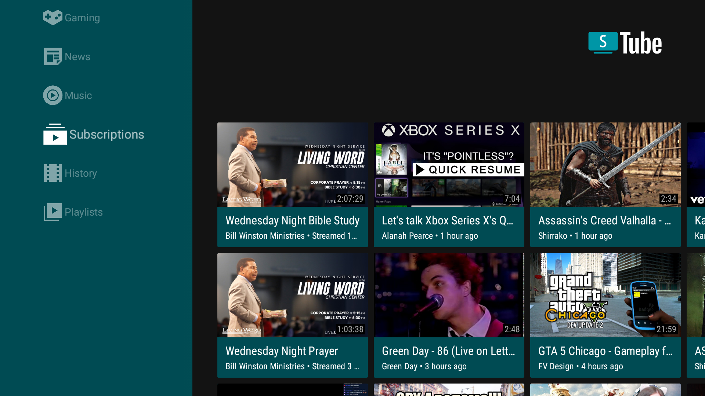
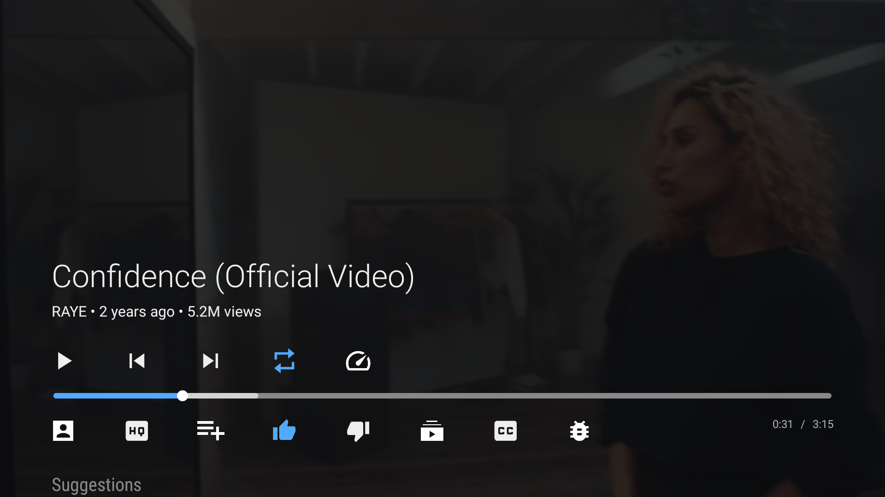
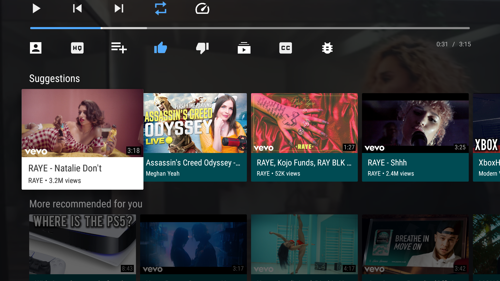
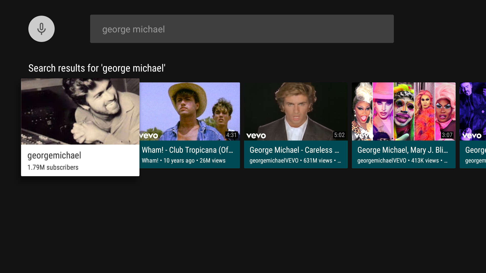
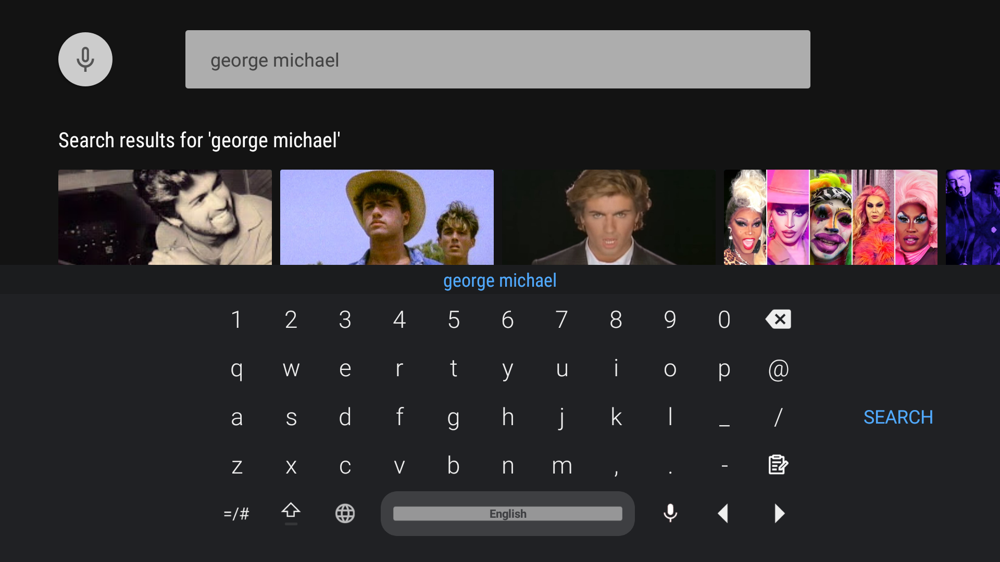
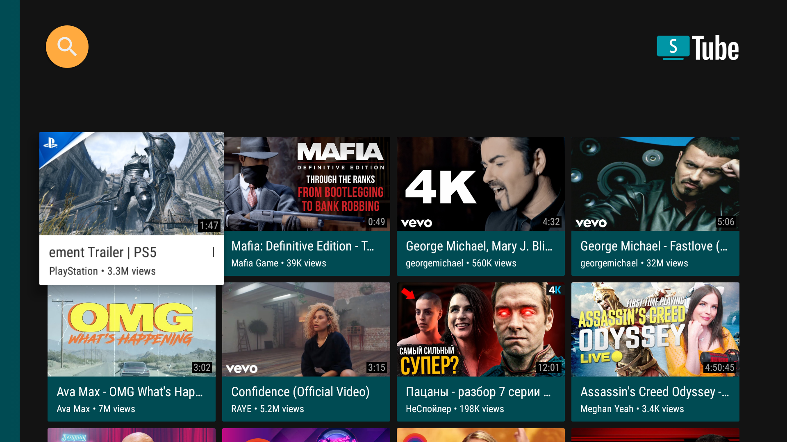

# SmartTubeNext 

<p align="center">
    
</p>

SmartTubeNext - Ad free app for watching tube videos on Android TV boxes.

Current release features:

- Run on Android 4.3 and above
- Browse News, Games, Music
- Browse Subscriptions, History, Playlists
- Play videos
- Like, Dislike or Subscribe for video
- Search for videos
- View subscribed channel content
- Change various settings for the video player
- Animated previews for videos
- Android TV channels and search support

__Useful links__:

- __[Latest release](https://bit.ly/3eke58k)__
- __[News EN](https://t.me/SmartTubeNextNewsEN)__
- __[News RU](https://t.me/SmartTubeNextNews)__
- __[FAQ EN](https://t.me/STNFAQENG)__
- __[FAQ RU](http://t.me/SmartTubeNextFAQ)__
- __[Ask a question EN](https://t.me/SmartTubeNext_en)__
- __[Ask a question RU](https://t.me/SmartTubeNext)__

# Donation

If you want to support my developments you are welcome to buy me a cup of coffee :)
- __[Donation Alerts (PayPal)](https://bit.ly/2HJJDXC)__
- __[QIWI (RU)](https://qiwi.com/n/GUESS025)__
- __[PrivatBank (UA)](https://privatbank.ua/ru/sendmoney?payment=9e46a6ef78)__
- __BTC: 1JAT5VVWarVBkpVbNDn8UA8HXNdrukuBSx__
- __LTC: ltc1qgc24eq9jl9cq78qnd5jpqhemkajg9vudwyd8pw__
- __ETH: 0xe455E21a085ae195a097cd4F456051A9916A5064__
- __ETC: 0x209eCd33Fa61fA92167595eB3Aea92EE1905c815__
- __XMR: 48QsMjqfkeW54vkgKyRnjodtYxdmLk6HXfTWPSZoaFPEDpoHDwFUciGCe1QC9VAeGrgGw4PKNAksX9RW7myFqYJQDN5cHGT__

# Screens

## [Browse Fragment](/smarttubetv/src/main/java/com/liskovsoft/smarttubenext/tv/ui/browse/BrowseFragment.java)

The browse fragment is what is used to display the browseable categories and options card. The
[Icon Header Item Presenter](/smarttubetv/src/main/java/com/liskovsoft/smarttubenext/tv/presenter/IconHeaderItemPresenter.java) is used
to setup and display the categories in the headers dock and  [Card Presenter](/smarttubetv/src/main/java/com/liskovsoft/smarttubenext/tv/presenter/CardPresenter.java)
is used to display the Video cards.

<p align="center">
    
</p>
<p align="center">
    
</p>

## [Playback Activity](/smarttubetv/src/main/java/com/liskovsoft/smarttubenext/tv/ui/playback/PlaybackActivity.java)

The Playback Activity is used to play the video from categories. Which used the [PlaybackFragment](/smarttubetv/src/main/java/com/liskovsoft/smarttubenext/tv/ui/playback/PlaybackFragment.java) to display the playback controls over the top of the PlaybackActivity.

<p align="center">
    
</p>

<p align="center">
    
</p>

## [Search Fragment](/smarttubetv/src/main/java/com.liskovsoft/smarttubenext/tv/ui/search/SearchFragment.java)

The Search Fragment allows users to search for video by either tags or usernames.

<p align="center">
    
</p>

<p align="center">
    
</p>

## [Header Grid Fragment](/smarttubetv/src/main/java/com/liskovsoft/smarttubenext/tv/ui/browse/grid/HeaderGridFragment.java)

The Header Grid Fragment is used to show a grid of videos from either a Subscriptions or History.

<p align="center">
    
</p>

# Custom Components

Many of the screens used some of these custom components created especially for the needs of this app:

## [Text Badge Image Card View](/smarttubetv/src/main/java/com/liskovsoft/smarttubenext/tv/ui/widgets/textbadgecard/TextBadgeImageCardView.java)

<p align="center">
    
</p>

This view extends the ImageCardView class so that we add custom functionality. The functionality
of this view is display a video preview of the video card that is currently in focus. It's made up
of the following components:

- [Text Badge Image View](/smarttubetv/src/main/java/com/liskovsoft/smarttubenext/tv/ui/widgets/textbadgecard/TextBadgeImageView.java) - This is a custom VideoView that automatically loops a video without sound.

# Building

To build, install and run a debug version, run this from the root of the project:

```
git clone https://github.com/yuliskov/SmartTubeNext.git
cd SmartTubeNext
git submodule update --init
gradlew buildStorigDebug
```

# Unit Tests

To run the unit tests for the application:

```gradlew testDebugUnitTest```

# User Interface Tests

To run the user interface tests for the application:

```gradlew connectedDebugAndroidTest```