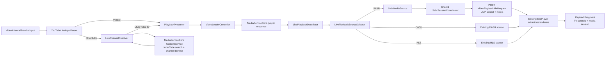
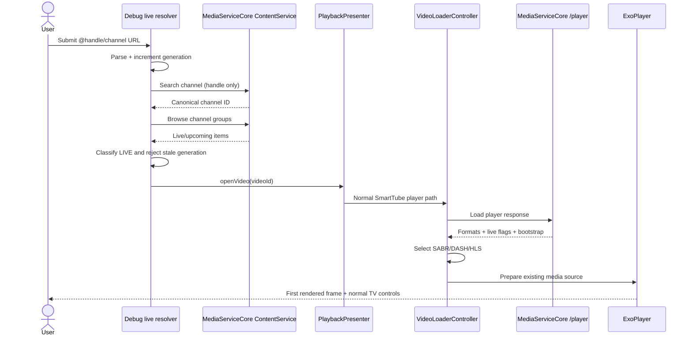
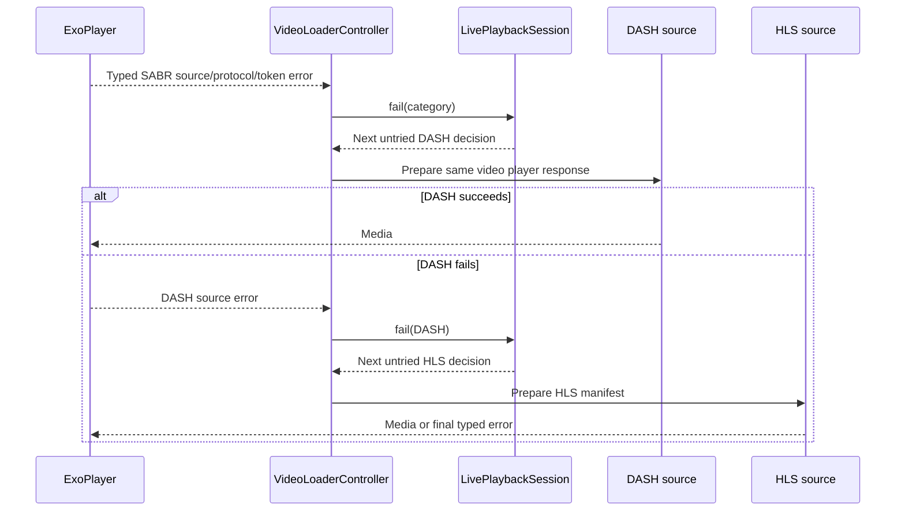
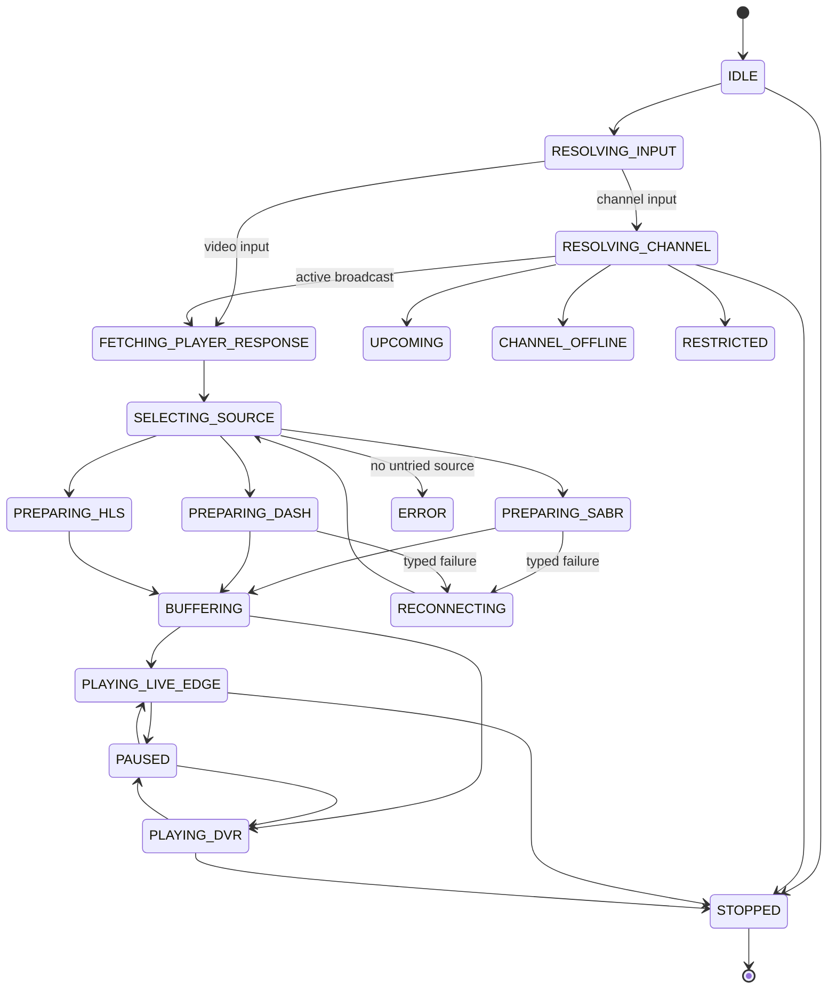

# YouTube live channel playback

## 1. Scope

This work is viewer-side playback of an existing YouTube broadcast on Android TV. It resolves a public channel or video input, obtains the normal MediaServiceCore `/player` result, chooses a usable media transport, and renders it through SmartTube's existing ExoPlayer surface. It does not create, schedule, ingest, encode, publish, record, restream, or manage broadcasts. The broadcaster-facing YouTube Live Streaming API and its OAuth scopes are intentionally out of scope.

## 2. Supported inputs

`YouTubeLiveInputParser` performs network-free normalization and accepts:

- an 11-character video ID;
- `youtube.com/watch?v=…`, with unrelated query parameters discarded;
- `youtube.com/live/<video-id>`;
- `youtu.be/<video-id>`;
- a 24-character `UC…` channel ID;
- `youtube.com/channel/<channel-id>` and its `/live` form;
- `@handle` and `youtube.com/@handle`, with optional `/live`;
- legacy `/c/name` and `/user/name` paths, normalized to a handle-shaped channel reference.

Only HTTP(S) YouTube hosts are accepted. Unsupported hosts, malformed identifiers, and arbitrary text fail at the boundary with a useful message.

## 3. Channel-to-active-broadcast resolution

The debug route constructs `MediaServiceLiveChannelProvider` with the existing `YouTubeServiceManager` `ContentService`. A `UC…` input goes directly through `getChannelObserve`. A handle first uses the existing InnerTube search path with `SearchOptions.TYPE_CHANNEL`, then browses the returned channel ID. This reuses SmartTube's visitor/authenticated session and adds no Data API key, broadcaster OAuth scope, or HTML scraper.

`LiveChannelResolver` disposes the backend observable when the user stops, exits, or supplies another input. A monotonically increasing request generation prevents an older completion from launching playback after a channel switch. Results are cached for 30 seconds; Refresh bypasses that cache. There is no background polling.

## 4. State classification

Resolution scans the channel items in this order:

1. `isLive && !isUpcoming` → **LIVE** and the item video ID is playable.
2. No live item, but an `isUpcoming` item → **UPCOMING**; it is displayed but not launched early.
3. A successful channel response without either → **OFFLINE**.
4. Failed/restricted/unavailable search or browse → **UNAVAILABLE**.

The subsequent `/player` result distinguishes ongoing live (`isLive`), post-live/live content (`isLiveContent && !isLive`), ordinary VOD, seekability, and playability. The common playback state vocabulary includes resolution, source preparation, buffering, live edge, DVR, pause, reconnect, upcoming, offline, restricted, error, and stopped states. The debug resolver owns the pre-player states; the normal player controller publishes transport and playback states.

## 5. Source selection and fallback

For one player-response generation, `LivePlaybackSourceSelector` chooses each available source at most once:

1. SABR, only when the gate is enabled and formats, endpoint, ustreamer config, and client identity are present.
2. Adaptive DASH formats, when accepted by existing device/preferences policy.
3. A live DASH manifest.
4. An HLS manifest.

`VideoLoaderController` maps SABR capability, token/protection, protocol/correlation, initialization, reload, cancellation, DASH, and HLS errors to typed failure categories. It records a metadata-only fallback reason, opens the next untried source, and tells `ErrorFixerController` not to launch its generic retry at the same time. Exhaustion ends in a typed error instead of recursion.

Production live SABR remains explicitly gated off because this checkout has no physical-TV or public-live capture evidence. The debug-only resolver sets a one-shot SABR gate before it launches the normal player. DASH/HLS production behavior therefore remains the safety path while the live SABR implementation can be exercised intentionally.

## 6. Existing SmartTube playback architecture

Playback continues through `PlaybackPresenter` → the normal `PlaybackActivity`/`PlaybackFragment` → `ExoPlayerController` → `ExoMediaSourceFactory`. This retains the existing render surface, track selector, captions, quality/audio controls, audio focus, media session, D-pad/media-key handling, overlays, activity lifecycle, and release path. The debug activity is only an input resolver; it does not own a second player or media session.

## 7. SABR requests, UMP, and ExoPlayer

`SabrManifest` creates a protobuf `VideoPlaybackAbrRequest`; `DefaultSabrChunkSource` sends it with HTTP POST and `Content-Type: application/x-protobuf`. The request contains the decoded ustreamer configuration, the exact `ClientInfo` supplied by MediaServiceCore, current player time, rate, bandwidth estimate, enabled track type, preferred/selected format IDs, audio track ID when present, DRC state, buffered ranges, prior playback cookie, and active/unsent SABR contexts.

The response remains on SmartTube's existing `SabrStream`/`SabrProcessor` path. `UMPDecoder` parses type and length values independent of network read boundaries and enforces part/allocation limits. Media is correlated by header ID and format ID across `FORMAT_INITIALIZATION_METADATA`, `MEDIA_HEADER`, one or more `MEDIA` parts, and `MEDIA_END`; the existing fragmented-MP4 and WebM extractors feed ExoPlayer samples. Unknown future part IDs are skipped rather than rejected solely because their numeric ID is high.

## 8. Shared audio/video session state

Every `SabrStream` created by one `SabrManifest` receives the same `SabrSessionCoordinator`. Audio and video therefore share:

- one monotonic request-number sequence and in-flight request accounting;
- endpoint and CDN/UMP redirects;
- playback cookie and next-request backoff/read-ahead policy;
- opaque context values and start/stop/discard sending policy;
- player-response/seek generation and stale-response rejection;
- protection/token refresh budget and reload budget;
- live-window metadata and redacted diagnostic events.

Track loaders keep their own extractors and selected formats, but they do not create unrelated server sessions.

## 9. Live metadata, DVR, seeking, and Go Live

Ongoing live streams are marked dynamic before the first response so an initial live media header can use the target duration even before `LIVE_METADATA` arrives. `SabrLiveWindowTracker` converts confirmed tick/timescale fields, tracks the moving head and min/max seekable bounds, slides or grows the window, identifies post-live transition, clamps seeks, and calculates a guarded Go Live target.

`SabrMediaSource` republishes an ExoPlayer `SinglePeriodTimeline` when that window materially changes. It does not invent a fixed multi-day duration. SABR seeks retire the old generation, clear unsafe in-flight/buffer accounting, clamp the requested position, and let `SABR_SEEK` adjust it. The player adds a live-only, focusable **Go Live** action that seeks to SmartTube's existing guarded live-edge position. If the engine exposes no positive timeline duration, the action does not issue a seek; ExoPlayer's existing timeline determines whether the seek bar itself is usable.

## 10. TV remote and media session

Because resolved playback opens the normal player, existing behavior remains authoritative: center/Play-Pause toggles playback, left/right use the established seek path, up/down expose controls, Back closes overlays before exiting, and dedicated/CEC-delivered media commands flow through the existing media session. Quality, audio, and captions remain existing SmartTube actions. The debug resolver uses large 10-foot text and explicit focus selectors, and has no touch-only interaction.

## 11. Retry, redirect, reload, and fallback

The scheduler combines target/minimum read-ahead, maximum request age, buffered audio/video duration, and server backoff against a monotonic clock. Endpoint connection failures can advance across the signed URL's advertised CDN network list without wrapping. `SABR_REDIRECT` updates the shared endpoint. `RELOAD_PLAYER_RESPONSE` marks a bounded reload-required state; the present checkout does not yet atomically call a MediaServiceCore reload callback, so repeated reload demand becomes a typed fallback rather than a loop. Protection refresh is bounded to one attempt. Close, seek, engine release, and new-video events retire the generation and clear pending request bookkeeping.

Fallback preserves the video/metadata object and opens the next transport in the same player. Exact cross-protocol DVR-offset conversion is not yet proven; where the fallback timeline cannot safely represent the same absolute window, normal player behavior starts near live edge.

## 12. Security and logging

Diagnostics may show input type, a video-ID suffix, typed resolver/player state, selected protocol, generation, request number, itags, buffered duration, window/latency, backoff, counts, and error categories. They must not show full signed URLs, authorization headers, cookies, visitor IDs, PO tokens, playback-cookie bytes, SABR context bytes, reload tokens, request bodies, or serialized player responses. Endpoint, cookie, token, reload, and context logging in this change is presence/count/category only. No camera/microphone permission, ingest URL, stream key, DRM bypass, broadcaster API, or broadcaster OAuth scope is added.

## 13. Test-fixture strategy

All automated tests are deterministic and offline. Input, channel resolution, caching/cancellation, source ordering, lifecycle state, and loop prevention use pure objects or Rx test providers. SABR tests use synthetic, sanitized protobuf/UMP frames generated in test code; they contain no real account state, signed URL, cookie, PO token, visitor ID, or raw player response. Decoder tests split every header boundary and payload boundary, join multiple frames in one input, test high unknown IDs, truncation, overflow, allocation limits, and cancellation. Demux/session tests cover interleaved audio/video header IDs, init retention, stale generation, cookies, contexts, redirect, protection budget, reload budget, scheduler backoff, live window, clamped seek, and post-live transition.

Important evidence label: these are **source-derived synthetic fixtures**, not a captured public live response. A public-live SABR session still needs device-side validation before enabling the production gate.

## 14. Manual Android TV validation

Build/install the debug APK, then launch the resolver explicitly:

```powershell
adb install -r .\smarttubetv\build\outputs\apk\stbeta\debug\SmartTube_beta_32.34_arm64-v8a.apk
adb shell am start -n org.smarttube.beta/com.liskovsoft.smartyoutubetv2.tv.ui.debug.SabrLivePlayerActivity --es live_input "@handle"
```

The equivalent debug-only deep link is `smarttube-debug://live?input=<URL-encoded-input>`.

The debug resolver keeps up to eight successful local inputs in its private preferences and exposes them as the input field's drop-down. This is a device-local test list, is absent from release UI, and hardcodes no public channel.

For each candidate, record whether the player response exposes SABR, DASH, and HLS, plus selected protocol, generation, request progress, A/V sync, live offset, DVR bounds, redirects/reloads, and typed fallback. Exercise a direct ID, channel ID, handle, upcoming channel, offline channel, DVR and non-DVR live broadcasts, Back/Home/resume, Play/Pause and CEC keys, quality/audio/captions, channel switching, network interruption, and another media app after exit. Run on Android/Google TV, supported Fire OS, a lower-memory AVC-only box, and a VP9/60-fps device where available. Never save raw diagnostic transport data.

ADB exposed a physical Android 15/API 35 OnePlus NE2215 during final verification, but it is a touch device without the Leanback/television feature. The app version was advanced to 32.34/2424, above the installed 32.33/2423. The built APK and installed package had the same signing-certificate SHA-256, so `adb install -r` upgraded the app successfully while preserving its data. A direct public-live candidate reached `PlaybackActivity`, but the screen remained black, the media session stayed at `NONE`, and the player-response/format path supplied no usable `streamingData`; the SABR decoder was therefore not reached or proven. An ordinary VOD baseline also failed in the normal player with HTTP 403 and media-session `ERROR`, so the available device environment could not isolate this as a live/SABR-specific regression. No fatal application exception was observed. Android/Google TV and Fire TV rendering, remote/CEC behavior, and successful public-live SABR playback remain **unverified**.

## 15. Known protocol uncertainties

- **Unknown:** no sanitized capture was available to confirm current live server ordering, long-duration A/V sync, or real endpoint expiry behavior.
- **Unknown:** `LIVE_METADATA_PROMISE`, its cancellation, `FORMAT_SELECTION_CONFIG`, selectable-format payloads, and `END_OF_TRACK` have IDs in the checkout but no matching protobuf schema/handler here. They are safely skipped, not claimed as implemented.
- **Strong implementation inference:** a shared request/cookie/context coordinator matches current server-directed SABR behavior, but only a real capture can prove every cross-track expectation.
- **Strong implementation inference:** the existing MediaServiceCore channel groups consistently surface the active broadcast before unrelated content; deterministic classification is tested, but live service ordering can evolve.
- **Unknown:** atomic `/player` reload with returned reload context is not wired in this checkout; bounded typed fallback is used.
- **Unknown:** absolute DVR position preservation across SABR→DASH/HLS is not proven.
- **Unknown:** production live SABR remains gated until a public SABR-capable live test passes on target hardware.

## 16. Component diagram



## 17. Channel resolution to first rendered frame



## 18. SABR failure and fallback



## 19. Live session states



## 20. Evidence labels, sources, and pins

Protocol statements in this document use these labels:

- **Confirmed by protobuf/source:** represented in the checked-out `.proto` files or executable implementation.
- **Confirmed by captured sanitized fixture:** none in this environment.
- **Confirmed by source-derived synthetic fixture:** exercised by deterministic generated test frames.
- **Strong implementation inference:** consistent across the checkout and independent reference implementation, but not official protocol documentation.
- **Unknown:** not established by current source or evidence.

Primary sources inspected on 2026-08-31:

- CryptoDragonLady/SmartTube implementation base: [`b2403052e67189f2ce826078c9d4e8ea164243ba`](https://github.com/CryptoDragonLady/SmartTube/commit/b2403052e67189f2ce826078c9d4e8ea164243ba).
- Upstream yuliskov/SmartTube reference head: [`26076c93237172af8e09656d2cfe06ab0d9eb872`](https://github.com/yuliskov/SmartTube/commit/26076c93237172af8e09656d2cfe06ab0d9eb872).
- Checked-out MediaServiceCore submodule compiled here: [`e37774d7ac2a34811bbfe5f25da9e8fc39fbc163`](https://github.com/yuliskov/MediaServiceCore/commit/e37774d7ac2a34811bbfe5f25da9e8fc39fbc163); reference repository head recorded as [`082e2e488cce739f224d0854773fc8d1cf14a48e`](https://github.com/yuliskov/MediaServiceCore/commit/082e2e488cce739f224d0854773fc8d1cf14a48e).
- Checked-out SharedModules submodule: `9a590e4acb0306eb3fe5b75bdb3c7bfe0db6efb8`.
- LuanRT/googlevideo reference: [`58f92b7ba8fc252a510963f003088279a00d4ab0`](https://github.com/LuanRT/googlevideo/commit/58f92b7ba8fc252a510963f003088279a00d4ab0), especially [`SabrStreamingAdapter.ts`](https://github.com/LuanRT/googlevideo/blob/58f92b7ba8fc252a510963f003088279a00d4ab0/src/core/SabrStreamingAdapter.ts), [`SabrUmpProcessor.ts`](https://github.com/LuanRT/googlevideo/blob/58f92b7ba8fc252a510963f003088279a00d4ab0/src/core/SabrUmpProcessor.ts), [`UmpReader.ts`](https://github.com/LuanRT/googlevideo/blob/58f92b7ba8fc252a510963f003088279a00d4ab0/src/core/UmpReader.ts), and the [video-streaming protos](https://github.com/LuanRT/googlevideo/tree/58f92b7ba8fc252a510963f003088279a00d4ab0/protos/video_streaming).
- LuanRT/kira live limitation reference: [`7a41cdc541cc80235a88314383b29a4a4ea712d1`](https://github.com/LuanRT/kira/commit/7a41cdc541cc80235a88314383b29a4a4ea712d1). Its README routes live/post-live through ordinary HLS/DASH, so it is not evidence that live SABR works.
- Official Android TV [playback controls](https://developer.android.com/training/tv/playback/controls), [playback overview](https://developer.android.com/training/tv/playback/), and [TV navigation](https://developer.android.com/training/tv/get-started/navigation).
- Official YouTube [Live Streaming API overview](https://developers.google.com/youtube/v3/live/getting-started), used only to establish that those resources create/manage broadcasts and are not the viewer playback API.

## Verification record

Environment: Windows 11, Oracle JDK 17.0.10, Gradle 7.5, Android SDK at the local user's standard SDK directory. Commands run from the feature worktree:

```text
.\gradlew.bat :exoplayer-library-sabr:testStbetaDebugUnitTest --console=plain
PASS — 175 actionable tasks, 1m43s (after porting the SABR changes to the clean base)

.\gradlew.bat :common:testStbetaDebugUnitTest --tests "com.liskovsoft.smartyoutubetv2.common.app.models.playback.live.*" --console=plain
PASS — 348 actionable tasks, 2m45s

.\gradlew.bat :common:compileStbetaDebugJavaWithJavac :common:testStbetaDebugUnitTest --tests "com.liskovsoft.smartyoutubetv2.common.app.models.playback.live.*" --console=plain
PASS — 348 actionable tasks, 3m39s

.\gradlew.bat lintStbetaRelease --console=plain
PASS — 849 actionable tasks, 6m02s (after replacing two new parser calls that exceeded minSdk 17)

.\gradlew.bat clean assembleStbetaRelease --console=plain
PASS — 852 actionable tasks, 10m05s

.\gradlew.bat :exoplayer-library-sabr:testStbetaDebugUnitTest :common:testStbetaDebugUnitTest :smarttubetv:assembleStbetaDebug --console=plain
PASS — 544 actionable tasks, 6m32s

.\gradlew.bat :exoplayer-library-sabr:testStbetaDebugUnitTest :youtubeapi:testStbetaDebugUnitTest :common:testStbetaDebugUnitTest --console=plain
PARTIAL — SABR passed; `youtubeapi` stopped the build with 108 failures and 60 skips out of 170 tests. The sampled failures share the checkout's old Robolectric/ASM class-loading failure (`NoClassDefFoundError` from `Shadows`, caused by `ClassNotFoundException`/`ClassReader`) under JDK 17. MediaServiceCore remained at its pinned, unmodified commit, so this is recorded as test-infrastructure evidence rather than a live-player pass.

.\gradlew.bat :smarttubetv:assembleStbetaDebug --console=plain
PASS — 479 actionable tasks, 4m47s. The arm64-v8a APK contains version 32.34/2424.

adb kill-server; adb start-server; adb devices -l
PASS — daemon restarted and device `6012a36c` returned online.

Device install/manual live playback
PARTIAL/FAIL — the matching signing certificate allowed a data-preserving upgrade from 32.33/2423 to 32.34/2424 on device `6012a36c`. The debug resolver rendered a typed `UNAVAILABLE` state for `@SkyNews`. A direct public-live candidate reached the normal player without a fatal crash, but produced no frame or active media session and never supplied usable `streamingData`, so actual live playback and SABR decoding failed to validate. A non-live VOD baseline also reached the normal player but failed with HTTP 403 and media-session `ERROR`, showing that playback on this device was broadly impaired rather than establishing a SABR-specific fault. The app was force-stopped after testing. The phone is not TV hardware, so D-pad, remote, and CEC behavior were not tested.
```

Verdict: **partial verification with a failed device-playback check**. Parser/resolution/session behavior, SABR protocol components, app compilation, lint, clean release assembly, versioned debug packaging, signature-compatible installation, and typed unavailable behavior are verified. Successful playback failed on the available phone for both the public-live candidate and a VOD baseline, before the live SABR decoder could be demonstrated. Actual public-live SABR playback, long-duration A/V sync, DVR/live-edge accuracy, TV remote/CEC behavior, and recovery on physical TV hardware are not verified and must not be inferred from these results.
